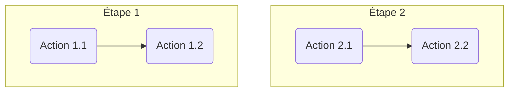

# Глоссарий
Панель администратора  -- админка.

# Определение

```mermaid
graph TB
    subgraph Étape 2
    b1(Action 2.1) --> b2(Action 2.2)
    end
    subgraph Étape 1
    a1(Action 1.1) --> a2(Action 1.2)
    end
```
ghgftrfh



